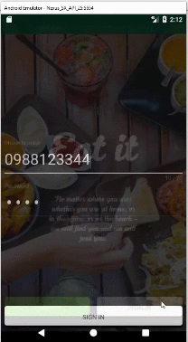
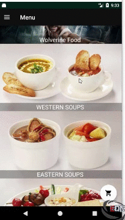
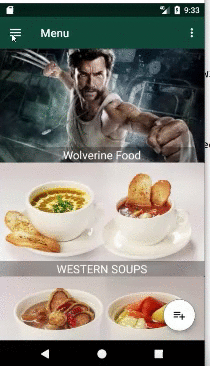
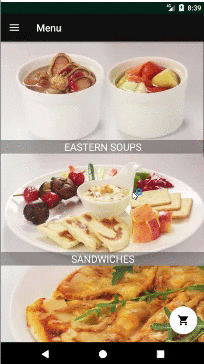

# Cafeteria

#Android application 

Both client and server side android application that send and receive orders. Employee can view their past orders and current food items present in the cafeteria and book accordingly. Server application can accept or reject order according to the availability. Firebase is used for realtime communication, notification and storage.

# Server Application - Takes order 

# Client Application - Gives order

# Place Order Client

  

# Client Server Order Management

  
  

# Food Rating

  

