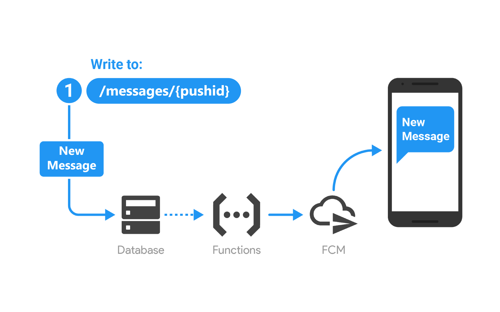

# Cafeteria

#Android application 

Both client and server side android application that send and receive orders. Employee can view their past orders and current food items present in the cafeteria and book accordingly. Server application can accept or reject order according to the availability. Firebase is used for realtime communication, notification and storage.

Server Application - Takes order 

Client Application - Gives order

<table border="0">
 <tr>
    <td><b style="font-size:20px">Client Order</b></td>
    <td><b style="font-size:20px">Food Rating</b></td>
 </tr>
 <tr>
    <td></td>
    <td></td>
 </tr>
</table>

<table border="0">
 <tr>
    <td><b style="font-size:20px">Client Order Notification</b></td>
    <td><b style="font-size:20px">Server Order Notification</b></td>
 </tr>
 <tr>
    <td> </td>
    <td></td>
 </tr>
</table>

## Building

### With Gradle

This project requires the [Android SDK](http://developer.android.com/sdk/index.html)
to be installed in your development environment. In addition you'll need to set
the `ANDROID_HOME` environment variable to the location of your SDK. For example:

    export ANDROID_HOME=/home/<user>/tools/android-sdk

After satisfying those requirements, the build is pretty simple:

* Run `./gradlew build installDevelopmentDebug` from the within the project folder.
It will build the project for you and install it to the connected Android device or running emulator.

The app is configured to allow you to install a development and production version in parallel on your device.

### With Android Studio
The easiest way to build is to install [Android Studio](https://developer.android.com/sdk/index.html) v2.+
with [Gradle](https://www.gradle.org/) v3.4.1
Once installed, then you can import the project into Android Studio:

1. Open `File`
2. Import Project
3. Select `build.gradle` under the project directory
4. Click `OK`

Then, Gradle will do everything for you.

### Firebase Push Notification

  

#### Reference
EDMTDev
